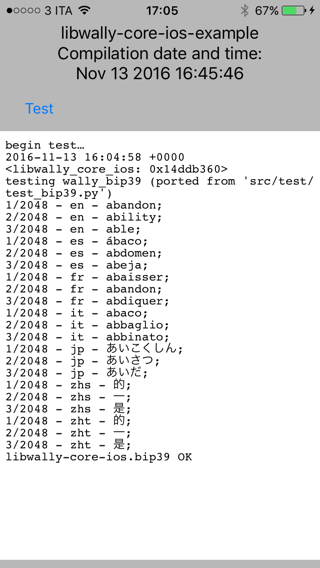

# libwally-core-ios-example

## Platforms

`Xcode 8.1`

## Dependencies

```c
$ brew install gnu-sed
```

## Configure

From the root directory of `libwally-core`
```c
$ ./tools/autogen.sh
$ ./configure --enable-debug --enable-export-all --enable-coverage
```

## Opening the project
```c
$ open ios/libwally-core-ios-example/libwally-core-ios-example.xcodeproj`
```

## Compiling the project

`CMD+B`

## Running the example
`CMD+R`

## Executing the test

Inside the app, tap the button `Test`


